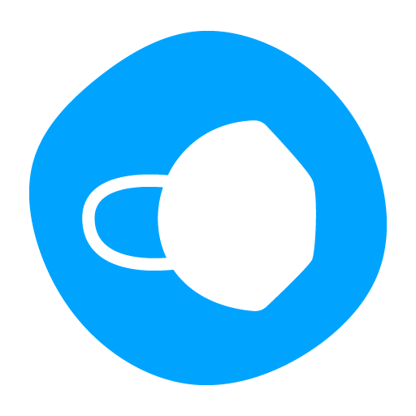

<br/>
<p align="center">
  <a href="https://github.com/markxoe/maskmanager">
    
  </a>

  <h3 align="center">Mask manager</h3>

  <p align="center">
    Organisiere deine Masken sinnvoll und effizient
    <br/>
    <br/>
    <a href="https://play.google.com/store/apps/details?id=org.toastbrot.maskmanager&utm_source=github&pcampaignid=pcampaignidMKT-Other-global-all-co-prtnr-py-PartBadge-Mar2515-1"></a>
    <a href="https://maskmanager.toastbrot.org/"></a>
  </p>
</p>


## Was ist das?

Mask manager ist eine App, um deine Masken zu organisieren. Die Masken markierst du mit kurzen Codes, sodass du weißt welche Maske welche ist. Eindeutige QR- oder Barcodes können mit einem integrierten Scanner verwendet werden. Mehr dazu unter [Der Die Das Barcode](#Der-Die-Das-Barcode)
Die App hilft dir bei dem Rotationsverfahren und zeigt dir, welche Maske du als nächstes tragen solltest

## Built With

- Ionic Framework
- Capacitor
- React

## Der Die Das Barcode

### Was muss der Inhalt sein?

Das ist eigentlich kack egal, nur musst du darauf achten, dass der Inhalt bei jeder Maske unterschiedlich ist.

### Gönn mal bitte Link

Im Internet gibt es viele Anbieter, die QR Codes auf Rollen anbieten.

Ein Beispiel hier: [https://barcodeetiketten.com/](https://barcodeetiketten.com/etiketten-6x6-folieweiss--8-ff-noplain-qr-300x?number=1-2S-850B-3-99999-U0)

### Kreatives Beispiel für einen QRCode


## Getting Started

### Du bist ein Enduser?

Dann gönn dir die App auf Android: [Google Play](https://play.google.com/store/apps/details?id=org.toastbrot.maskmanager&utm_source=github-enduser&pcampaignid=pcampaignidMKT-Other-global-all-co-prtnr-py-PartBadge-Mar2515-1)

Oder für das Web und iOS (bei iOS auf `Zum Startbildschirm hinzufügen` klicken, es lohnt sich) als PWA verfügbar: [PWA](https://maskmanager.toastbrot.org/)

Aber: Apple mag es anders zu sein, deshalb geht die Kamera bei iOS nicht, wenn man die Website zum Startbildschirm hinzufügt und dann öffnet.

### Ne i bims Entwickler

Dann gönn dir folgendes

### Vorbereitungen

1. Node.js & NPM installieren
2. Ionic CLI könnte hilfreich werden: `npm install -g @ionic/cli`

### Installation

1. Repository clonen

```sh
git clone https://github.com/markxoe/maskmanager
```

3. NPM Packages installieren

```sh
npm install
```

3. Für Web Production kompilieren

```sh
ionic build
```

4. Für Nativ kompilieren:
   - Android
     1. Kompilieren und Native Module kopieren: `ionic cap sync android`
     2. Android Studio öffnen: `ionic cap open android`
   - iOS
     1. Kompilieren und Native Module kopieren: `ionic cap sync ios`
     2. XCode öffnen: `ionic cap open ios`

## Contributing

Jeder Beitrag wird **sehr geschätzt**.

### How to: Contributing

- Du hast eine Idee? Öffne ein [Issue](https://github.com/markxoe/maskmanager/issues/new) oder
- Du willst selber Programmieren? Forke das Projekt und erstelle ein Pull Request! Erstelle dazu einen neuen Branch und merge deinen Pull Request in den `develop` branch.

## License

Distributed under the GNU GPLv3. See [LICENSE](https://github.com/markxoe/maskmanager/blob/master/LICENSE) for more information.

<p style="font-size: 5px">Google Play and the Google Play logo are trademarks of Google LLC.</p>
